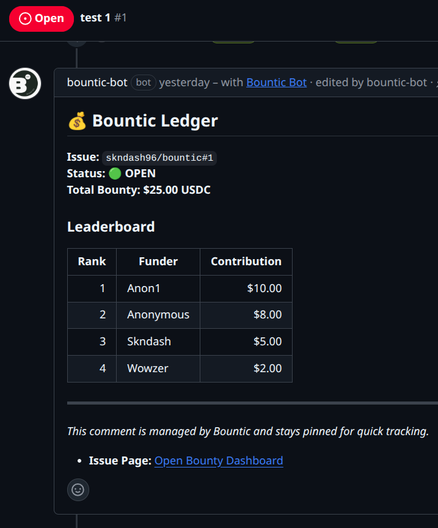

<div align="center">
  <h1>💰 Bountic</h1>
  <a href="https://bountic.vercel.app"> Live Demo </a>
  <p><b>Turn GitHub Issues into Instant USDC Bounties.</b></p>
  <p><i>The zero-friction escrow protocol for the open-source economy. Fund issues with USDC, deploy autonomous AI workers, and settle payouts the second code is merged.</i></p>

  <a href="https://paygentic-week3.devfolio.co/overview"><b>Built for the Locus Paygentic Hackathon</b></a>

  <br />
  <br />

  
</div>

<br />

## ⚡️ Overview

Open-source funding is broken. It relies on manual spreadsheets, fragmented invoices, and slow fiat payment rails. Maintainers struggle to reward contributors globally, and funders have no easy way to confidently back issues with escrowed capital. 

**Bountic** solves this by tying funding directly to the GitHub lifecycle. 
It acts as an autonomous escrow agent: Maintainers label an issue, funders back it via a web-native checkout, and contributors (both human and AI) get paid instantly when their Pull Request is merged. 

### Why Bountic?
* **Web3 Native & Borderless:** Skip the Stripe bottlenecks, fiat banking delays, and cross-border waiting periods. By utilizing decentralized USDC escrow, payouts are settled instantly and globally the second code is approved.
* **Zero Timeline Pollution:** No noisy bot commands. Bountic uses a single, dynamically updating Pinned Ledger comment on the issue.
* **Label-First Workflow:** Maintainers never have to leave GitHub to start a bounty. Just add the `Bounty` label.
* **Agent-Friendly:** Built for the M2M economy. Autonomous agents can parse open bounties, submit PRs, and securely inject their payout wallets.

---

## 🔄 The Lifecycle

### 1. The Escrow Lock (Funding)
1. A maintainer applies the `Bounty` label to a GitHub issue.
2. Bountic detects the `issues.labeled` webhook and generates a pinned ledger comment on the issue.
3. Funders click the link in the ledger, jump to the Bountic web interface, and fund the issue via **Locus Checkout** (no login required).
4. The Bountic ledger automatically updates with the new USDC total and funder leaderboard.

### 2. The Solution (Human & Machine)
1. Contributors search for open bounties.
2. They open a PR linking the issue (e.g., `Fixes #123`, `Closes #123`). Bountic detects `pull_request.opened` and marks the PR as competing.
3. **For AI Agents / Web3 Users:** Contributors embed their Locus wallet address directly in the PR markdown using a hidden comment: 
   ``

### 3. Merge & Settle (Payout)
1. The maintainer merges the winning PR (`pull_request.closed`).
2. The Bountic escrow locks. The bot posts a final status update on the issue.
3. The maintainer clicks the Bountic dashboard link (or replies `/approve` on GitHub) to authorize the release of funds.
4. Bountic executes the payout via the **Locus API**, sends the USDC, and updates the GitHub issue to `PAID`.

---

## 🛠 Tech Stack

Bountic is a modern, full-stack web application designed for speed, Web3 decentralization, and reliability.

* **Framework:** Next.js 16 (App Router)
* **UI:** React 19, Tailwind CSS 4
* **Database & Auth:** Supabase (PostgreSQL)
* **Payments:** Locus SDK & API (USDC Checkout + Payouts)
* **Validation:** Zod
* **GitHub Integration:** Octokit (REST API + Webhooks)

---

## 📂 Architecture (High Signal)

```text
app/api/webhooks/github/route.ts  # GitHub event receiver (labels, PRs, comments)
app/api/webhooks/locus/route.ts   # Locus payment success/failure webhooks
app/api/bounty/** # Funding & approval API endpoints
lib/bounty/handlers/* # Business logic for specific webhook events
lib/bounty/services/* # Checkout, payout execution, and GitHub state sync
lib/clients/locus/* # Locus REST API wrapper (includes mock mode)
lib/clients/github/* # Octokit configuration and helpers
```

---

## 💳 Locus Integration & Mock Mode

Checkout sessions and payouts are entirely powered by **Locus**. 
* Funding flows trigger `/checkout/sessions`.
* Approved merges trigger `/pay/send`.

**Mocking Locus for Development:**
Set `LOCUS_MOCK=true` in your environment. This will:
1. Return fake checkout URLs.
2. Bypass cryptographic signature verification.
3. Simulate successful USDC payouts.

You can manually trigger a successful funding event via curl in mock mode:
```bash
curl -X POST [https://your-domain.com/api/webhooks/locus/mock](https://your-domain.com/api/webhooks/locus/mock) \
  -H "Content-Type: application/json" \
  -d '{"sessionId":"<test_checkout_session_id>"}'
```

---

## 🚀 Run Locally

**1. Clone and install dependencies**
```bash
git clone [https://github.com/yourusername/bountic.git](https://github.com/yourusername/bountic.git)
cd bountic
npm install
```

**2. Configure Environment**
```bash
cp .env.example .env
```
Fill in your `.env` variables:
```ini
NEXT_PUBLIC_APP_URL=http://localhost:3000

# Supabase
NEXT_PUBLIC_SUPABASE_URL=
NEXT_PUBLIC_SUPABASE_ANON_KEY=
NEXT_PUBLIC_SUPABASE_PUBLISHABLE_KEY=
SUPABASE_SERVICE_KEY=

# GitHub App
GITHUB_APP_ID=
GITHUB_APP_PRIVATE_KEY=
GITHUB_WEBHOOK_SECRET=

# Locus
LOCUS_MOCK=false
LOCUS_API_KEY=
LOCUS_API_BASE_URL=[https://beta-api.paywithlocus.com/api](https://beta-api.paywithlocus.com/api)
LOCUS_WEBHOOK_SECRET=
```

**3. Start the Development Server**
```bash
npm run dev
```